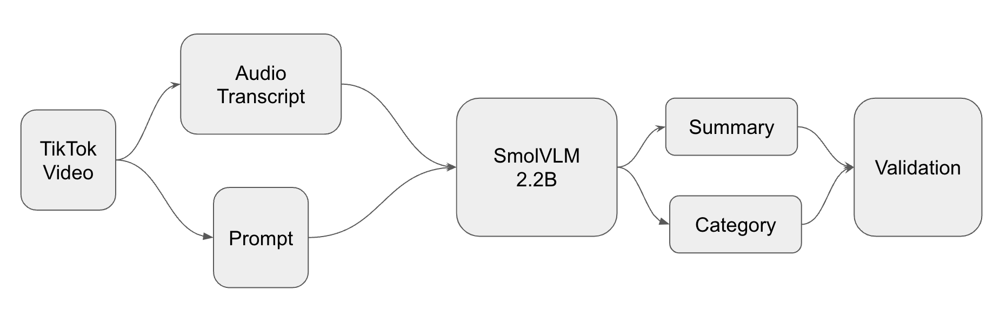
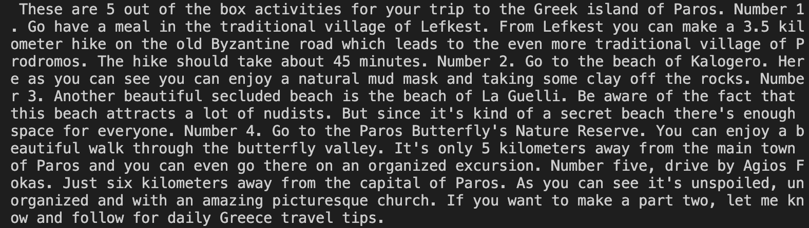

**Objective**

Build and optimize a video summarization pipeline using an open-source model.
You will:

- Process a given set of videos.
- Generate concise and grounded textual summaries using an existing open-source model.
- Measure and record inference times for each component in the pipeline.
- Measure and record performance of the generated responses against ground truth responses
- Propose and implement optimizations to reduce total inference time.

**Dataset**

You will be provided with 270 TikTok videos in .mp4 format and their corresponding transcripts in .txt files (available on [Google Drive](https://drive.google.com/drive/folders/1ZexqdCYpCQPpSjxL38Y8NpvPNCz_lJwH?usp=drive_link)). Each video has a unique file name, and the video durations range from approximately 5 seconds to 5 minutes. Your goal is to generate this information for each video using a Vision Language Model (VLM):

* Summary: A detailed and factual summary of the video content (no hallucinations).
* Category: One label selected from a predefined set of categories (see [here](https://github.com/AjayKumarGogineni/vlm-inference/blob/899de3b908cb64b8b5ee08cabe29e1d5b3855ee2/inference_utils.py#L11)).

**Validation**

The generated responses should be compared against the ground truth responses to evaluate performance of summary and accuracy of category selection. We will be using BERTScore for evaluating summary.


**Baseline Model**

Use this open-source model for video summarization:

- SmolVLM2-2.2B-Instruct (https://huggingface.co/HuggingFaceTB/SmolVLM2-2.2B-Instruct, https://huggingface.co/blog/smolvlm2)

**Pipeline Requirements**

Your code should include the following components:

Steps with Description

1. Video Loading	   -    Load and read the videos
2. Audio Transcription - 	Extract and transcribe audio to text
3. Prompt Creation	 - 	  Generate the prompt in a format expected by the model
4. Text Generation	 -    Generate the textual summary and the video category by passing the prompt to the model
5. Post-processing	 -    Clean and format the model output. Compute and report the evaluation metrics against ground truth.



***Input Examples***

TikTok video frame:


Audio Transcript:



***Ground Truth***

Ground Truth Summary:
`The video is a travel vlog highlighting five unique activities to do on the Greek island of Paros. The presenter, speaking in a casual and enthusiastic tone, suggests: 1. Having a meal in Lefkes and hiking the Byzantine road to Prodromos, which takes about 45 minutes. 2. Visiting Kalogero beach for a natural mud mask, where one can use clay from the rocks. 3. Exploring Laggeri beach, described as secluded and a nudist beach, noting that there's enough space for everyone. 4. Visiting the Butterfly nature reserve, located 5 kilometers from Paros town, which can be reached via an organized excursion. 5. Driving by Agios Fokas, a place located 6 kilometers from the capital of Paros, featuring an unorganized yet picturesque church. The video concludes by asking viewers if they would like a part two and encouraging them to follow for daily Greece travel tips.`

Ground Truth Category:
`Travel & Events`

***Predictions***

Predicted Summary:
`The video showcases various activities and locations in the Greek island of Paros. It begins with a person standing in front of a scenic view of the sea and white buildings, with the text Paros 5 out of the box activities! displayed at the top. The person gestures and points towards the camera, indicating the start of the video. The scene transitions to a person in a red and white striped shirt standing in front of a picturesque white building with blue accents, with the text Could you do a vid on Paros please? 🙏 at the top.`

Predicted Category:
`Travel & Events`

**Part A — Baseline Measurement**

Implement the full pipeline using the baseline model.
Record execution time for:

- Video loading
- Audio transcription
- Text generation
- Total inference time

Save these measurements in a CSV file for analysis.

Record performance metric for:

- Summary quality : BERTScore
- Category prediction : Accuracy

**Part B — Optimization**

Apply at least two different optimization strategies to the baseline model to improve inference time and evaluation metrics.

- Sample key frames from the video and only pass them to the model.
- Model quantization (e.g., bitsandbytes, torch.quantization).
- Use model pruning or distillation.
- Use mixed precision (torch.float16).
- Batch processing of frames.
- Parallel data loading.
- Combination or any new techniques.

After applying optimizations, re-run timing tests and report improvements compared to the baseline.

**Deliverables**

- Main Project presentation
- Code (.ipynb or .py)
- Timing report - CSV file recording inference times before and after optimization
- Short report (2–3 pages) covering:
  - Model choice and rationale
  - Baseline performance
  - Optimization techniques used
  - Trade-offs between speed and summary quality
  - Future improvements

You have been provided with a basic template to begin with. You are welcome to make changes as needed to improve upon it.

**Steps to run the code**

1. Clone the repository to your local machine.
2. Create a virtual environment using Python 3.11 and activate it:
```bash
python3.11 -m venv venv
source venv/bin/activate  # On Windows use `venv\Scripts\activate`
```
3. Install the required dependencies listed in requirements.txt by running the following command:
```bash
pip install -r requirements.txt
```
4. Download the dataset of TikTok videos and audio transcripts from the Google drive link ([Google Drive](https://drive.google.com/drive/folders/1ZexqdCYpCQPpSjxL38Y8NpvPNCz_lJwH?usp=drive_link))and place them in the `data/inputs/videos/` and `data/inputs/audio_transcripts/` directories respectively.
5. Update the paths in config.py to point to the correct input and output directories if required. The current pipeline will save the outputs in `data/outputs/` directory by default
6. Run main.py to execute the video summarization pipeline. The pipeline processes each video sequentially, generates a summary and category for each video, and saves the results to a CSV file. It also records inference times and evaluation metrics.
```bash
python main.py
```
7. Sample output files with baseline performance can be found in the `data/outputs/` directory.

**Possible issues**

1. Ensure the paths in config.py are correctly set to your local directories.
2. Ensure to use Python 3.11 as some dependencies may not be compatible with other versions.
